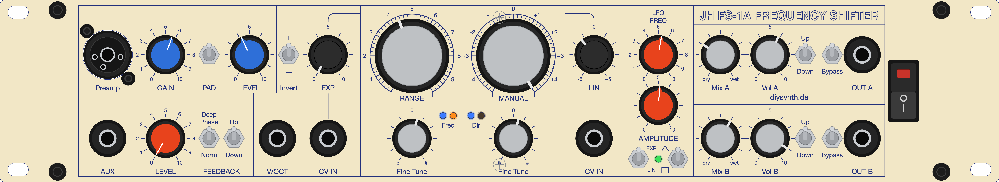
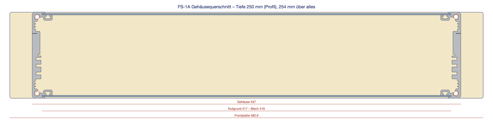
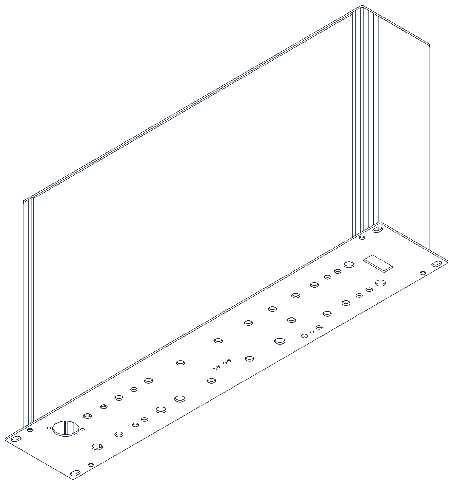

# Jürgen Haible FS-1A Frequency Shifter — 19" / 2 U case

Complete mechanical design for a rack-mount build of Jürgen Haible's **FS-1A frequency
shifter**: front panel, rear panel, side rails, top and bottom covers, plus a 3D assembly.

Everything is generated by Python scripts from one shared geometry model, so a changed
dimension propagates to *all* outputs — SVG, DXF, Schaeffer FrontDesign `.fpd`, the
print-ready PDF, the drill schedule and the STEP assembly.



The panel layout follows the well-known Van Daal Electronics build of the FS-1A (cream
panel, dark blue legend, framed function blocks, two large RANGE / MANUAL dials). Circuit
design: Jürgen Haible. This repository contains mechanical data only — no schematics, no
PCB files.

---

## Bill of materials

| Qty | Part | Size / spec | File |
|---|---|---|---|
| 1 | Front panel | 482.6 × 88.1 × 2 mm, corner R2 | `fs1a_frontpanel.fpd` or `fs1a_frontpanel_druck.fpd` |
| 1 | Rear panel | 437 × 88.1 × 2 mm, corner R2 | `fs1a_rueckwand.fpd` |
| 2 | Side rail | Gie-Tec *Seitenteilprofil 4* (art. 122040), cut to **250 mm** | purchased part |
| 2 | Top / bottom cover | 416 × 249.5 × **1.5 mm** aluminium sheet, one Ø3.1 hole | `fs1a_deckel_boden.dxf` |
| 8 | Screw M5 | thread-forming, into the rail screw channels (4 front, 4 rear) | — |
| 2 | Angle bracket | Keystone **633**, panel to top and bottom cover | — |
| 2 | Nut M3 | onto the panel studs | — |
| 2 | Screw M3 + nut | bracket to cover | — |

Overall size **482.6 × 88.1 × 254 mm** (panel), body 437 mm wide, 250 mm deep.
Aluminium volume 769.7 cm³ ≈ **2.1 kg**.

---

## Front panel

482.6 × 88.1 mm, 2 mm aluminium, **48 cutouts**, 123 legend items. Controls left to right:

* **Preamp** — Neutrik combo XLR/jack input, GAIN, PAD, LEVEL, signal + clip LED
* **AUX** — jack input, LEVEL, FEEDBACK (Deep Phase / Norm, Up / Down)
* **Invert**, **EXP** attenuator, **V/OCT** and **CV IN** jacks
* **RANGE** and **MANUAL** — 19 mm dials with 300° scales and fine graduation, 2 × Fine Tune, Freq / Dir LEDs
* **LIN** attenuator with **CV IN**
* **LFO** — FREQ, AMPLITUDE, EXP/LIN and triangle/square switches, LED
* **Out A / Out B** — Mix (dry…wet), Vol, Up/Down, Bypass, output jack each
* Illuminated **rocker power switch** at the right-hand edge

### Two variants

| File | Process |
|---|---|
| `fs1a_frontpanel.fpd` | Legend as native FrontDesign text and HPGL engravings — engrave and fill, or switch the whole panel to printing |
| `fs1a_frontpanel_druck.fpd` | Anodised aluminium plus a **full-surface UV colour print** (cream + blue), holes as drill elements — this is the one that looks like the reference build |

The print variant needs **"white flood"** enabled in *Panel properties* (Schaeffer prints
white only on request; without it the aluminium shows through and the cream turns grey).
The print artwork `fs1a_frontpanel_druck.pdf` is vector, sRGB, 1 mm bleed all round, and
contains no holes or panel outline — as required by Schaeffer's print-data guide.

### Hole schedule

| Item | Ø / size (mm) | Notes |
|---|---|---|
| Potentiometers | 7.5 | Alpha 16 mm, M7 bushing |
| 6.35 mm jacks | 9.5 | Neutrik NYS / Cliff |
| Neutrik combo **NCJ6FI-S** | 24.0 | plus 2 × Ø3.2, offset 20 × 23 mm (top left / bottom right), Neutrik drawing 3102ST1728 |
| Toggle switches (10 ×) | 6.0 | M6 bushing |
| LEDs (7 ×) | 3.2 | 3 mm, no bezel |
| Power rocker | 12.3 × 27.2, R1 | Marquardt 1555.3102, snap-in, mounted upright; datasheet cut-out 27.2 ±0.1 × 12.2 +0.2, panel 0.8–5 mm |
| M5 fixing screws | 5.3 | x 27.8 / 454.8, y 4.9 / 83.2 |
| Rack slots | 10 × 6.4 | 465.1 mm pitch, ±38.1 mm from panel centre |
| M3 studs | no hole | 2 × glued-in stud GU30, 6 mm, on the **rear face** at x 241.3, y 8.35 and 79.75 |

Full list with coordinates: `fs1a_frontpanel_bohrungen.csv`
(columns: no., part, x from left, y from top, Ø, note).

---

## Stiffening brackets

To stop the panel twisting against the covers, an **M3 stud** sits on the rear face of the
front panel, top and bottom centre (FrontDesign `Bolt`, type GU30 = glued-in stud with
3 mm thread, 6 mm long). A **Keystone 633** angle bracket goes onto the stud, its other
leg is screwed to the top or bottom cover.

Bracket data (nickel-plated brass): legs 9.5 × 9.5 mm, width 7.1 mm, material 0.81 mm,
both holes Ø3.7 mm, **hole centre 5.5 mm from the outer face of the other leg**. Everything
else follows from that:

| Feature | Value |
|---|---|
| Stud on the panel | x 241.3 (centre), y **8.35** and **79.75** from the top edge |
| Hole in top and bottom cover | Ø **3.1**, centred (208 mm from the left edge), **5.5 mm from the front edge** |
| Stud axis to sheet face | 5.5 mm (= bracket dimension D) |
| Nearest component | Fine Tune pot, 14.4 mm away — clear |

## Rear panel

437 × 88.1 × 2 mm, natural anodised, unprinted. One Ø12 mm cable gland hole at
x = 40 mm from the left, 30 mm from the bottom, plus the four M5 holes into the rail
channels (x 5 / 432, y 4.9 / 83.2).

---

## Enclosure

The two side rails are **Gie-Tec Seitenteilprofil 4** (art. 122040, "side rail for 19"
enclosures, 2 U"), 88.30 mm tall, 20.50 mm deep, front face 16 mm. Their dimensions were
taken from the manufacturer's own CAD file; the extracted cross-section is stored as
`gietec_122040_profil.dat` and drives both the 2D section drawing and the 3D model.

* **Screw channels** Ø4.5 for M5, 5 mm from top and bottom edge (**78.3 mm apart**) and
  5 mm behind the outer face → the panel screws sit at x 27.8 / 454.8 mm.
* **Sheet grooves** 1.6 mm wide at 1.4–3.0 mm and 85.3–86.9 mm panel height, groove
  bottom 10 mm behind the outer face, 3 mm deep.
* Clear width between the groove bottoms 417 mm → cover sheets **416 mm** wide
  (2.5 mm engagement per side, 0.5 mm play), 249.5 mm long (0.5 mm shorter than the rails).



Because the rails sit behind the panel (x 22.8–38.8 and 443.8–459.8 mm), no component
body may reach into those zones — the generator keeps them clear, and
`pruefung_gehaeusezonen.png` shows the zones overlaid on the layout.

> **Covers cannot be ordered from Schaeffer.** 416 × 249.5 mm is not available in 1.5 mm
> (their designer rejects it: *"the larger dimension is too big or the panel is too
> thin"*). 2 mm would be available but does not fit the 1.6 mm groove. Order the two
> covers as a plain sheet-metal cut from `fs1a_deckel_boden.dxf`.

---

## 3D assembly

`fs1a_gehaeuse.step` — STEP AP214, eight named solids, built with FreeCAD from the same
geometry model:

| Solid | Size (mm) | Volume |
|---|---|---|
| Frontplatte (front panel) | 482.6 × 2 × 88.1 | 79.98 cm³ |
| Rueckwand (rear panel) | 437 × 2 × 88.1 | 76.59 cm³ |
| Seitenteil links / rechts (side rails) | 20.5 × 250 × 88.3 | 150.86 cm³ each |
| Deckel / Boden (top / bottom cover) | 416 × 249.5 × 1.5 | 155.68 cm³ each |
| Gewindebolzen oben / unten (studs) | Ø3 × 6 | 0.04 cm³ each |

Origin: X = width from the left panel edge, Y = depth from the back of the front panel
(+Y rearwards), Z = height from the bottom panel edge. The rails protrude 0.1 mm above
and below the panel (88.3 vs 88.1 mm).



---

## Files

Scripts and their outputs (file names are German; this table maps them):

| File | What it is |
|---|---|
| `fs1a_panel.py` | Front panel generator — all dimensions, hole diameters, colours and fonts are constants at the top |
| `fs1a_rueckwand.py` | Rear panel generator (imports `fs1a_panel` as a library) |
| `fs1a_gehaeuse.py` | Enclosure: covers, cross-section drawing, bill of materials |
| `fs1a_step.py` | FreeCAD script that builds the STEP assembly |
| `fs1a_frontpanel.svg` / `.dxf` / `.fpd` / `.fpjs` | Front panel, engraved variant |
| `fs1a_frontpanel_druck.*` | Front panel, colour-print variant (`.pdf` = print artwork) |
| `fs1a_frontpanel_bohrungen.csv` | Drill schedule (Bohrungen = holes) |
| `fs1a_rueckwand.*` | Rear panel in the same formats |
| `fs1a_deckel_boden.dxf` / `_zeichnung.svg` | Covers (Deckel = lid, Boden = bottom): cutting outline and dimensioned drawing |
| `fs1a_gehaeuse.step` | 3D assembly |
| `gietec_122040_profil.dat` | Side-rail cross-section, extracted from Gie-Tec's published CAD file |
| `rowmans.jhf` | Hershey "Roman Simplex" stroke font, used for text-as-paths in the DXF (public domain) |
| `README.de.md` | Full German documentation (more detail than this summary) |

### Regenerating

```bash
python3 fs1a_panel.py        # front panel: SVG, DXF, FPJS, CSV, print SVG + PDF
python3 fs1a_rueckwand.py    # rear panel
python3 fs1a_gehaeuse.py     # covers, cross section, BOM
/Applications/FreeCAD.app/Contents/Resources/bin/freecadcmd fs1a_step.py   # STEP
```

Only the Python standard library is required. The print PDF is rendered with headless
Google Chrome (path in `fs1a_panel.py`); the STEP needs FreeCAD 1.0.

The `.fpd` files are produced by running the generated `.fpjs` inside Schaeffer
FrontDesign: *Edit → Scripts → PastePad →* `EvalFile("/path/to/fs1a_frontpanel.fpjs");`
→ *Start*. Note that the white-print options are dialog-only and must be set by hand
after regenerating the print variant.

---

## Before you order

* Check every hole diameter against the parts you actually bought — the values are
  defaults for the components listed above.
* The combo jack is the **solder version NCJ6FI-S** (Ø24, screws 20 × 23 mm). The PCB
  version NCJ6FA-H needs Ø22 and 19.8 × 19.8 mm — constants `COMBO_SCREW_DX/DY`.
* Toggle holes are 6.0 mm; 1/4" bushings need 6.35 mm.
* Convert the text to paths before sending the SVG anywhere (the DXF already contains
  stroke-font outlines).
* Mains wiring: the illuminated rocker carries line voltage right next to the output
  jacks — use fully insulated 6.3 mm receptacles.

## Known simplifications

* The rail cross-section is closed along the front mounting face in the 3D model, so the
  three M3 slots on that face are missing. Everything else matches the manufacturer's
  contour.
* The enclosure depth of 250 mm is the **rail length**; with front and rear panel the
  outside depth is 254 mm. Change `BOX_DEPTH` in `fs1a_gehaeuse.py` if you want the
  other convention.

## License

© 2026 Dsl-man.de — [CC BY-SA 4.0](../LICENSE). Build it, change it, sell it; credit the
source and pass your changes on under the same license.

## Credits

* FS-1A circuit design: **Jürgen Haible** († 2011)
* Panel layout inspired by the **Van Daal Electronics** FS-1A build
* Side-rail geometry: **Gie-Tec GmbH**, from their published CAD data for article 122040
* Rocker switch data: **Marquardt** 1555.3102 datasheet · combo jack: **Neutrik** NCJ6FI-S
