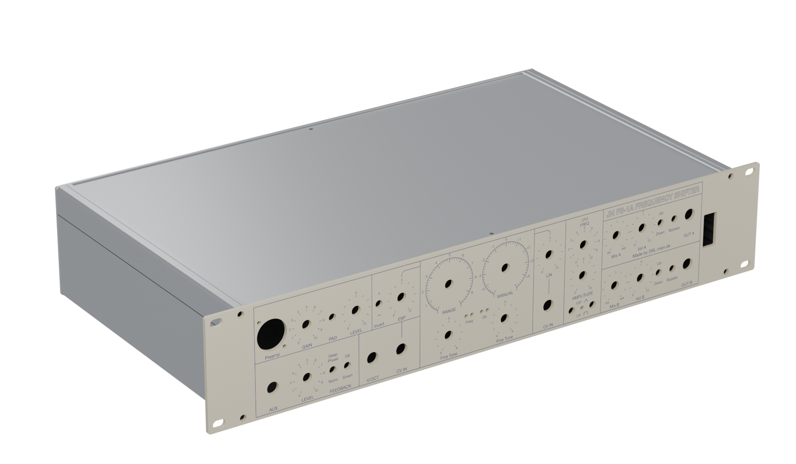
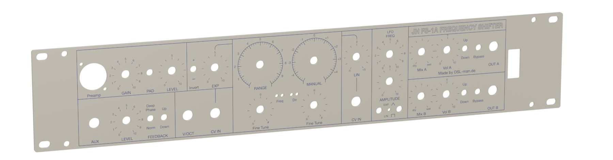
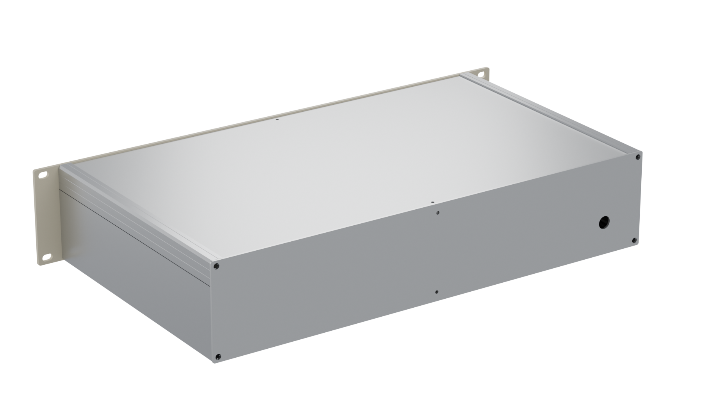
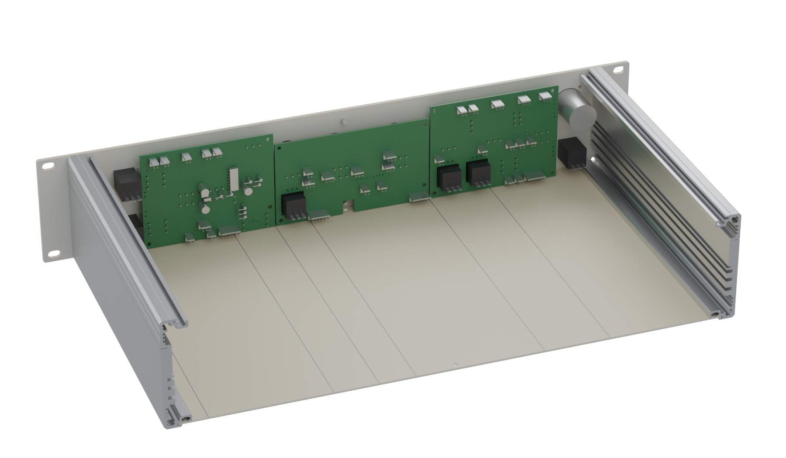
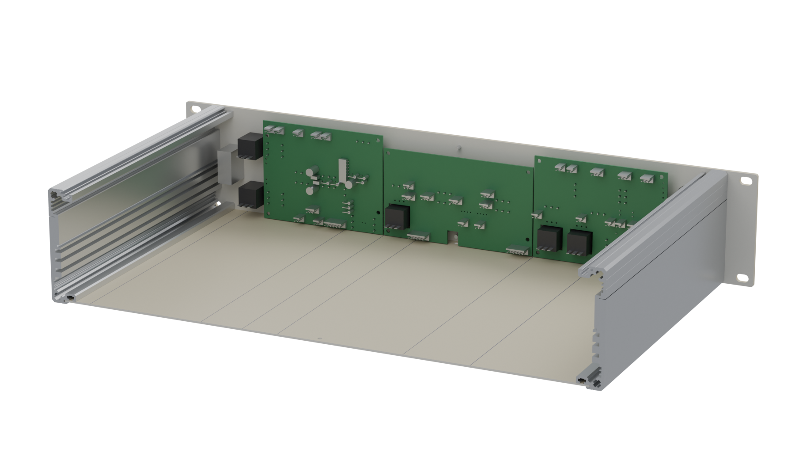

# Case designs

Mechanical designs (front panels, rear panels, enclosures) for DIY synthesizer and
effects projects — parametric, generated from Python scripts, with ready-to-order
manufacturing files.

*FS-1A Frequency Shifter: 19" / 2 U enclosure, front panel with the full-surface
colour print, and the rear. Rendered from the STEP assembly these files produce —
the panel carries the actual print artwork, not a mock-up.*

**[Turn it around in your browser](https://dslmande.github.io/fs1a-case-3d/)** — an
interactive 3D view of the enclosure and the control PCBs.

| Design | Description |
|---|---|
| [FS-1A Frequency Shifter](FS-1A-Frequency-Shifter/) | 19" / 2 U front panel, rear panel and enclosure for Jürgen Haible's FS-1A frequency shifter |

Every design folder contains the generator scripts, the production files (Schaeffer
`.fpd`, DXF, print-ready PDF), a 3D assembly as STEP, and its own README.

## Control panel PCBs

For the FS-1A there is a set of control panel PCBs that carries the pots, switches,
jacks and LEDs behind the front panel, so the build needs no point-to-point wiring.
Three boards, one per block of the panel layout, wired to each other with a single
6-way link and to Haible's boards with the connectors he already uses.

Those boards are not part of this repository — they are **available on request from
[diysynth.de](https://diysynth.de)**.

## License

© 2026 Dsl-man.de

Licensed under [Creative Commons Attribution-ShareAlike 4.0 International](LICENSE)
(CC BY-SA 4.0) — including the generator scripts. You may build, modify and redistribute
these designs, commercially too, as long as you credit the source and share your changes
under the same license.

Third-party data included for reference keeps its own origin: the side-rail cross-section
comes from Gie-Tec's published CAD file, `rowmans.jhf` is the public-domain Hershey font.
